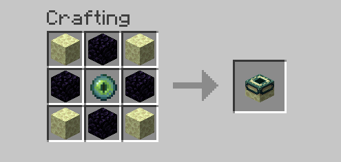

# CraftableEndPortals

 A datapack, that allows crafting and breaking of end portals in survival

Crafting recipe (shapeless):

You can also destory end portals using a Lingering Potion of Weakness

